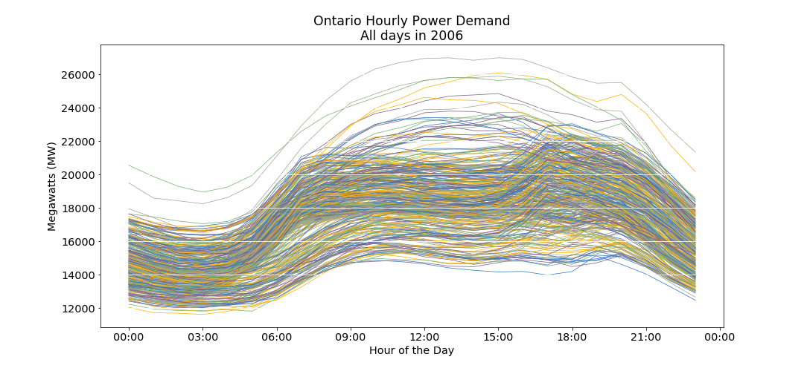

# Predicting Daily Peak Electricity Demand during Ontario Summers

1.	[Business Proposal](#1-business-proposal)
2.	[Project Objectives](#2-project-objectives)
3.	[Data Sources](#3-data-sources)
4.	[Data Wrangling](#4-data-wrangling)
5.	[Exploratory Data Analysis](#5-exploratory-data-analysis)
6.	[Assessment Metrics](#6-assessment-metrics)
7.  [Cross Validation and Testing Strategy](#7-cross-validation-and-testing-strategy)
8.  [Data Scoping](#8-data-scoping)
9.	[Feature Selection](#9-feature-selection)
10. [Feature Engineering](#10-feature-engineering)
11. [Decomposing the Data](#11-decomposing-the-data)
12. [Baseline Model](#12-baseline-model)
13. [Modelling Strategy](#13-modelling-strategy)
14. [Model Prediction Review & Diagnosis](#14-model-prediction-review-and-diagnosis)
15. [Selecting The Best Model](#15-selecting-the-best-model)
16. [Test Data Results](#16-test-data-results)
17. [Next Steps](#17-next-steps)
18. [Conclusion](#18-conclusion)
19. [Appendix: Tips for Reproducing This Project](#19-appendix-tips-for-reproducing this project)
  

## 1. Business Proposal
### 1.1 Customer Qualification
Are you a heavy electrical power user based in Ontario?
We have a service that can cut your electricity costs by over C$500,000 per year

You qualify as a customer for this scheme if you:

+ Are based in Ontario, and draw all your electrical power from the Ontario grid
+ Run a daily electrical demand of 3MW or more, over Summer
+ Can curtail electricity demand on 5 separate afternoons between late May and early October. An afternoon is defined as 12:00 PM to 8:00 PM

Did you know your power usage on just 5 days of the year determines over 50% of your electricity costs?

### 1.2 Example
Consider a factory with an average stable monthly electrical demand of 6.3MW. The annual electricity costs will be about C$6,000,000. About 40% - 50% of this cost is directly related to consumed energy – i.e. Total KW hours consumed x $ per KW Hour.
However, the other **50% - 60% of total cost is based on how much electricity the factory used on just 5 days over the past year** – These are the [5 days](https://www.google.com/url?sa=t&rct=j&q=&esrc=s&source=web&cd=1&ved=2ahUKEwjPxrXaq5blAhXBY98KHRxKASYQFjAAegQIAhAC&url=http%3A%2F%2Fwww.ieso.ca%2F-%2Fmedia%2Ffiles%2Fieso%2Fdocument-library%2Fglobal-adjustment%2Funderstanding-global-adjustment.pdf&usg=AOvVaw0KsqKv4fJzPn5bEunXex5g) when electricity demand across the whole of Ontario was highest. This is the largest line item on your electricity bill, and is called [Global Adjustment (GA)](http://www.ieso.ca/en/Learn/Electricity-Pricing/What-is-Global-Adjustment)

### 1.3 Proposal
Between late May and early October you will receive 5 notifications of a predicted peak load day `n` days in advance.

You will curtail your electricity usage by at least `X%` between 12:00 PM and 8:00 PM on the predicted peak load days. This is called a curtailment event.

When your Global Adjustment Charge is re-calculated the following year, you will save at least `Y*%`. You will pay 10% of the savings to the prediction service

If you do not save at least `Y%`, you will be reimbursed at a pre agreed cost of `$Z` per curtailment event. 

Note:
`n`, `X`, `Y` and `Z` are unique to each customer, and will be based on a free operations assessment.
  
	

## 2. Project Objectives
The original intent of the project was to predict year-round hourly electricity demand. Having investigated [the cost structure of large user’s bills](https://globalnews.ca/news/2839995/what-is-the-global-adjustment-fee-the-mysterious-cost-ontario-hydro-customers-must-pay/), the project was re-scoped. The revised intent is to develop a prediction model that will predict electrical peak demand days in Ontario over summer. The model has to be good enough to make the business model viable. Therefore, the model should:

+ Predict with the highest possible level of accuracy
+ Perform better than just choosing the highest temperature days
+ Make predictions with enough consistency that the financial risk of running the service can be quantified
  

## 3. Data Sources
The body that manages electrical power supply in Ontario is the Independent Electricity System Operator (IESO). Their publication [Methodology to Perform Long Term Assessments](http://www.ieso.ca/-/media/files/ieso/document-library/planning-forecasts/18-month-outlook/methodology_rtaa_2017mar.pdf) identifies the major factors that drive Ontario power usage:

+ Power Demand Data – Available in various formats
+ Calendar Variables – Weekdays, Weekends, Public Holidays
+ Weather – temperature, humidity, etc. Acute weather conditions drive peak demand
+ Economic Data – GDP – stronger economic activity drives power demand higher
+ Conservation – higher energy efficiency drives lower demand

### 3.1 Historical Power Demand Data
Available for every hour in yearly .csv files on the [Independent Electricity System operator’s (IESO) Website](http://www.ieso.ca/Power-Data/Data-Directory). Nineteen files were manually downloaded from the website.

### 3.2 Calendar Variables
Ontario historical holiday dates are available in a python package – [holidays](https://pypi.org/project/holidays/)

### 3.3 Weather
This was a bit more complicated. There are hundreds of weather stations across Ontario, each collecting different data at different frequencies, with each station identified by a unique station number. Furthermore, over the years, stations may change the data collected, the collection frequency, and their station number.
The Canadian Ministry of Environment provides a csv file containing all this metadata. The relevant station numbers and time periods were manually extracted. These were then used as parameters in a command line script to download the .csv files. The script ran 6 times to download 816 files.

### 3.4 Economic Data
Historical data by quarter available in an Excel Spreadsheet downloadable from the [Ontario Ministry of Finance website](https://www.fin.gov.on.ca/en/economy/ecaccts/oea_hist.xlsx)

### 3.5 Conservation
No aggregated publicly available data

  

## 4. Data Wrangling	
### 4.1	Compilation
The power data was in yearly csv files. These were indexed on a pandas date time index, and compiled into a single multi-year file. The pre-2002 data was formatted slightly differently to the rest, requiring an enhanced data processing function. The date and time data was stored across multiple fields, requiring consolidation to a single date time field. The compiled data set comprised 222,096 rows of data, with each row containing the total Ontario power usage for every hour between 1994 and mid 2019.

The weather data was compiled in a similar manner. This was slightly easier in that the field names were consistent across the whole data set. The compiled data set comprised 582,248 rows of data for 9 variables, where each row represents an hour, and the variables include temperature, relative humidity, and wind speed, and others

### 4.2	Data Quality Problems & Remedies
#### 4.2.1 Missing Data
The power data had a single full month of missing data out of a total of 300 months, or 0.32%.The missing month was December; a critical month in terms of peak power load. Fortunately, there are fairly consistent patterns from year to year, month to month, and day to day. Therefore, I searched for the closest in time (to keep economic conditions most similar) December data where the average monthly temperature of the replacement data was closest to the average monthly temperature of the missing data. The replacement data also needed to be offset so that the Christmas holidays lined up across the data sets. For repeatability, the processing data was captured in a code variable.

There was a small amount of missing data within the temperature data. Out of 582,433 data points there were 185 missing points, representing 0.03% of the total data. The missing data was randomly scattered through the dataset. Therefore, I felt comfortable imputing the missing data using linear interpolation.
#### 4.2.2 Outliers
In August 2003, Ontario and the Northeast USA suffered one of the [largest power outages in history](https://en.wikipedia.org/wiki/Northeast_blackout_of_2003). Power was lost for several days. In the period following the outage, demand was artificially reduced through a public appeal to consumers to reduce air conditioner usage. If ever there was an outlier, this is it. I considered removing this data, but thought a more representative strategy would be to fill across the 6 days with data from the closest equivalent days. For repeatability, this processing was captured in code variable.

I also investigated the impact of the 911 terrorist attacks in 2001, when all North American civil aviation was grounded for 3 days. Although power usage appeared to be slightly lower, there did not appear to be a significant impact relative to normal variation.

#### Notebooks
+ [Demand Data - Compile & Review](https://github.com/DMacGillivray/ontario-peak-power-forecasting/blob/master/notebooks/03.01%20-%20Data%20-%20Demand%20Data%20-%20Compile%20%26%20Review.ipynb) 

+ [Demand Data - Inpute Missing Values & Deal with Outliers](https://github.com/DMacGillivray/ontario-peak-power-forecasting/blob/master/notebooks/03.02%20-%20Data%20-%20Demand%20Data%20-%20Impute%20Missing%20Values%20%26%20Deal%20with%20Outliers.ipynb) 

+ [Weather Data - Compile & Impute Missing Values](https://github.com/DMacGillivray/ontario-peak-power-forecasting/blob/master/notebooks/03.03%20-%20Data%20-%20Weather%20Data%20-%20Compile%20%26%20Impute%20Missing%20Values.ipynb)

+ [Calendar Data - Compile](https://github.com/DMacGillivray/ontario-peak-power-forecasting/blob/master/notebooks/03.04%20-%20Data%20-%20Calendar%20Data%20-%20Compile.ipynb)

+ [Merge Demand, Weather, Calendar Data](https://github.com/DMacGillivray/ontario-peak-power-forecasting/blob/master/notebooks/03.05%20-%20Data%20-%20Merge%20Demand%2C%20Weather%2C%20Calendar%20Data.ipynb)

  

## 5. Exploratory Data Analysis
### 5.1 Ontario Electrical Power Demand
The chart below shows the electrical power usage in Ontario for every hour of every day between January 1st 1994, and June 11th 2019.

    

### 5.2 Impact of Temperature
Making sense of the valleys and troughs in this chart feels a bit overwhelming, so let's choose a random year – 2006 - and zoom into the details for that year.

    

 
This is a bit easier on the eye. It seems that power demand is high in the winters, low in spring and fall, and very high in summer. We could make a reasonable assumption that high power usage is related to both cold and hot weather.
We can review this relationship by plotting temperature against power demand.

    

 
The plot shows that as temperature goes to the extreme highs or lows, power demand goes up accordingly. This makes sense if we consider that our heating and cooling systems use electricity, and these systems tend to get used more when temperatures are more extreme.
The other factor on this chart that seems to make a difference, is whether the day is a weekday or a weekend. The highest power demand occurs on weekdays.

So, let's look the pattern of daily power usage over a week.
We can do this by plotting all 52 weeks of the year 2006 on the same chart. If there is a weekly pattern, this should show up on the chart.
### 5.3 Impact of Day of the Week
 
 

    

Typically, it seems that power usage tends to be higher from Monday to Thursday. It drops slightly on Friday, and then drops further on Saturday and Sunday.
Therefore, it is not too much of a stretch to assume that as people's activities increase, so does their power usage. And the main activity of a high proportion of people is their work.
### 5.4 Impact of Hour of the Day

    

For many people, their work day starts in the morning and ends in the evening. Therefore, we could hypothesize that if we plotted every day's power usage for 2006 on the same chart, we would see a pattern related to most people's working hours.
 
The chart shows a clear pattern where power demand increases at around 6:00 AM. It stays level until about 4:00 PM, and kicks upwards at around 5:00 or 6:00 PM, before declining to a low at around 3:00 AM
### 5.5 Power Demand over a Typical Ontario Week 
We can combine our data for weekdays, and hours of the day by taking all the above data, and plotting a heat map, where the higher power demand shows as a more intense colour.

    

 
The heat map combines the weekly, and hourly demand data to present a clear picture as to the weekly and hourly demand cycles. Clearly, weekdays between 4:00 PM and 8:00 PM tend to demand the highest electrical power.
### 5.6 Summary
+ Power Demand is related to temperature, in a shape like a check mark. As the temperature gets above 15C, demand goes up. As the temperature goes lower than about 10C, demand also goes up. Demand seems to be more sharply associated with hot temperatures, rather than cold temperatures.
+ Over a week, Power Demand is higher on week days, than at weekends. This is probably due to work activity driving power demand.
+ Over a day, Power Demand hits a trough at around 3:00 AM, and increases during the day. It reaches its’ highest levels between 9:00 AM and 8:00 PM, with peak demand occurring between 4:00PM and 8:00 PM.

#### Notebooks
+ [Visualization Code](https://github.com/DMacGillivray/ontario-peak-power-forecasting/blob/master/notebooks/04.01%20-%20Exploratory%20Data%20Analysis%20Setup.ipynb) 

+ [EDA Full Notebook](https://github.com/DMacGillivray/ontario-peak-power-forecasting/blob/master/notebooks/04.02%20-%20Exploratory%20Data%20Analysis%20-%20Full%20Notebook.ipynb)

 
+ [EDA Key Points](https://github.com/DMacGillivray/ontario-peak-power-forecasting/blob/master/notebooks/04.03%20-%20Exploratory%20Data%20Analysis%20-%20Key%20Points.ipynb) 

+ [EDA Modelling Peak Daily Demand](https://github.com/DMacGillivray/ontario-peak-power-forecasting/blob/master/notebooks/04.04%20-%20Exploratory%20Data%20Analysis%20-%20Modeling%20Peak%20Daily%20Demand.ipynb)

  

## 6. Assessment Metrics
### 6.1 Bounded Precision
The customer will only reduce their electricity costs if the model successful predicts the peak demand days. The business service will nominate 5 days as possible peaks. Therefore, the most natural metric is a hit rate i.e. what % of peaks are accurately predicted. I will call this metric “bounded precision”.

Bounded Precision = Number of peaks correctly predicted / 5 predictions

So, if we accurately predict only 1 peak out of our 5 attempts:

Bounded Precision = 1/5 = 0.2 = 20%

#### Worked Example

| Top 5 Actual Peaks  | Demand MW (sorted desc.)&nbsp;&nbsp; | Top 5 Predicted Peaks&nbsp;&nbsp;  | Predicted Demand (MW)
|:------------- |:-------------|-----|---------|
| *17-Jun-94&nbsp;&nbsp;&nbsp;&nbsp;&nbsp;&nbsp;&nbsp;&nbsp;&nbsp;&nbsp;&nbsp;&nbsp;&nbsp;&nbsp;&nbsp;&nbsp;&nbsp;&nbsp;&nbsp;&nbsp; | 20918 | 9-Jul-94 | 21674 |
| *16-Jun-94 | 20468 | **17-Jun-94** | 21506 |
| 08-Jul-94 | 20239 | 20-Jun-94 | 21140 |
| *06-Jul-94 | 20196 | **06-Jul-94** | 21095 |
| 21-Jun-94 | 19953 | **16-Jun-94** | 20906 |

Reviewing the table above, we sort the actual demand from the highest demand day to the lowest demand day. We do the same for predicted demand. We only get to make predictions on 5 days, so we can cut the table off after the fifth value. Now we can count how many of the predicted dates are in the actual dates. These are shown in bold in the table above.

In this case we correctly predicted 3 out of the 5 peak dates, so our bounded precision was 60% 

 
This metric is crucial. It is the metric that determines whether the business proposal is viable. But, it is a bit too crude to use when developing models.

Therefore, I will also use a more sophisticated metric to compare model performance – mean absolute error.

### 6.2 Mean Absolute Error
The mean of the absolute values of each prediction error across the whole data set, where prediction error is the difference between the actual value and the predicted value - [mean absolute error](https://scikit-learn.org/stable/modules/model_evaluation.html#mean-absolute-error)

#### Notebooks
+ [Scoring](https://github.com/DMacGillivray/ontario-peak-power-forecasting/blob/master/notebooks/05.02%20-%20Modeling%20Setup%20-%20Scoring.ipynb)

  

## 7. Cross Validation and Testing Strategy

### 7.1 Annual Time Series Cross Validation Scheme
The illustration shows a potential cross validation and testing strategy. The last five years - 2014 to 2018 – are held out for final testing. The prior years are split to give a 10 fold time series cross validation. 
#### Advantages:
+ Uses the full data set
#### Disadvantages:
+ Uses the full data set – We saw in the exploratory data analysis that power demand patterns have changed over the years. If we are predicting on the final fold, where 2013 is the validation set- Is 1994 really representative of the market in 2013? This is explored further in the next section. But, in short, we don’t have numbers for structural market changes such as the ownership of residential air conditioning, or for conservation installations such as LED lighting. Therefore, using all the data may not be the best cross validation strategy

    

### 7.2 Rolling Annual Time Series Cross Validation Scheme
The illustration shows a 5 year rolling window cross validation and testing strategy. The last 10 years - 2009 to 2018 – are held out for final testing. The prior years are split to give a 10 fold time series cross validation with a fixed number of years (5) used for training. 
#### Advantages:
+ Recent years may be more representative of future years
+ Faster runs of models
+ May tend to diminish the impact of trends and trend change points
+ If a smaller window gives a reasonable prediction, we may be able to release more data as test sets. This could allow us to develop better confidence around performance on unseen data. This concept is shown in the second illustration.
#### Disadvantages:
+ What is the right rolling window? In the 90’s this could have been a 10 year window, in the early 2000s this could have been a 2 year window. 

    

 

### 7.3 Selecting the Rolling Time Window
+ If I had to draw a chart of next year's demand by reviewing a chart of the last 100 years of data, I would draw a chart that looked exactly the same as last year + or - any obvious trend.
+ We are making a prediction for a single year ahead, using our cross validation scheme. If we only choose a single year of training data, then our model will miss out on trends, and will be working on a 50/50 train validation split. Therefore, our training period should be greater than 1 year.
+ Two years of training data is not enough because, as an example, there is a random element to the weather. If we have a hot summer followed by a cold summer, this could be seen as a trend, but it is really randomness. Therefore, our training period should be greater than 2 years.
+ Twenty years seems too long for training data because I suspect the underlying structure of the data may change between Year 1 and Year 20. For example shifts in air conditioner ownership, and LED installations, will certainly change the underlying structure of demand patterns.
+ So far, I have made the case that 2 years is too short, and twenty years too long. This still leaves a big span. My judgement is that a training period of 5 years is reasonable. This gives a train/ validation split of 5/1. My judgement is that this period is long enough to capture trends, and short enough so that the training data gives a reasonably close representation of the validation data
+ This scheme allows half the data to be used to create and tune a model, and leaves the other half of the data for testing - to get a measure of the best model’s performance on unseen data.
+ In summary:
  + Training Data - 1994 to 2008 with a 10 fold rolling time series cross validation
  + Training sets restricted to previous 5 years
  + Test Data – Held out for appraising the final model selection - 2009 to 2018 - 10 years

#### Notebooks
+ [Time Series Cross Validation Schemes](https://github.com/DMacGillivray/ontario-peak-power-forecasting/blob/master/notebooks/05.03%20-%20Modeling%20Setup%20-%20Time%20Series%20Cross%20Validation.ipynb)
+ [Selecting a Cross Validation Rolling Window](https://github.com/DMacGillivray/ontario-peak-power-forecasting/blob/master/notebooks/07.00%20-%20Modeling%20-%20Select%20Cross%20Validation%20Rolling%20Window%20Size.ipynb)

  

## 8. Data Scoping
The business solution is defined as providing predictions for working days over summer.
We have collected data that covers every hour of the year for a period of 25 years.
This means two tasks are required before modelling.

1.	Cut back the scope of the data to cover working days in Summer
2.	Calculate features that help predict daily peak electricity demand – Next Section

### 8.1 Approximating Summer
We need to catch the summer peaks, so we can look at a sample of the data, to see when the peaks occur. Reviewing the years 1994 to 1997, the earliest annual peak occurs in Mid-June, and the last peak occurs in early September. However, because it is always possible for early or late heatwaves to happen, we can build some contingency into our data scope by selecting data between late May and early October.

The 5 peaks for 1994 are shown below. These are typical of other years

| Date        | Time           | Day of Week  |
| ------------- |-------------| -----|
| 17-Jun-94 | 1:00 PM | Friday |
| 16-Jun-94 | 3:00 PM | Thursday |
| 08-Jul-94 | 1:00 PM | Friday |
| 06-Jul-94 | 3:00 PM | Wednesday |
| 21-Jun-94 | 3:00 PM | Tuesday |

### 8.2 Defining the Summer Prediction Window
Summer solstice is the longest day of the year and gives us a natural datum for defining summer. For the 36 years between 1994 and 2050, the summer solstice occurs in Week 25 in 35 of those years. In the other year it occurs on Day 1 of week 26. Therefore, we will use Week 25 as a reference point and subtract 4 weeks from this to get to Week 21 as the start of our summer. We can add 15 weeks to week 25 to get Week 40 as the last day of summer. This defines our prediction window as a 20 week period starting in Week 21 and going up to, and including, Week 40. This reduces the scope to 7 x 20 = 140 days.

### 8.3 Reducing the Scope to Working Days
Because we are targeting a business customer, we can further reduce the scope by only considering working days. In fact, working days are the only opportunities a business has for curtailment, and luckily, the vast majority of time, working days coincide with peak demand.
If we consider Monday to Friday, this gives us 5 days x 20 week = 100 days to consider.

However, we can reduce this further by eliminating statutory holidays. There are 4 Mondays every year between Week 21 and week 42 that are statutory holidays. We can subtract these 4 days to get to a 96 day prediction window.

#### Notebooks
+ [Scoping The Data](https://github.com/DMacGillivray/ontario-peak-power-forecasting/blob/master/notebooks/06.01%20-%20Features%20-%20Scoping.ipynb)

  

## 9. Feature Selection
We are making predictions for daily maximum power demand, and we know that temperature is one of the main drivers. However, there may be other weather factors that drive demand, but we do not know what they are.

### 9.1 Daily Features
There are quite a few considerations to take into account.

For example, if visibility is low, does this mean that lighting load is higher?
How does dew point affect comfort levels? If it is difficult to sweat due to high humidity, this makes the temperature feel higher than the actual temperature reading. In Canada this is captured in a humidex reading.

Is median daily temperature a better feature than mean temperature? If the temperature distribution over a day is skewed, then the mean may not be the most representative statistic to capture temperature.
Should daily temperature range be considered?

We know from the exploratory data analysis that power consumption tends to be slightly lower on a Friday than the rest of the working week. However, in 1994, the highest annual peak occurred on a Friday.

Does the previous day’s temperature impact the current day’s power usage? If there is a prolonged heatwave, does this mean that more power is used on a 30C day, as compared to a single 30C day in the middle of a cool period?

It is pretty difficult to answer these questions – These are complex relationships.
However, we can calculate statistics for our weather factors and try some visualizations to attempt to identify relationships.
These statistics were selected as daily features worth further review

+ Temperature - minimum, maximum, mean, median, earliest hour with highest, earliest hour with lowest
+ Dew Point Temperature - minimum, maximum, mean, median, earliest hour with highest/lowest
+ Wind Speed - minimum, maximum, mean, median, earliest hour with highest/lowest
+ Relative Humidity - minimum, maximum, mean, median, earliest hour with highest/lowest
+ Visibility - minimum, maximum, mean, median, earliest hour with highest/lowest
+ Pressure - minimum, maximum, mean, median, earliest hour with highest/lowest
+ Humidex - minimum, maximum, mean, median, earliest hour with highest/lowest (Some of the humidex values are missing, but these can be calculated - Humidex Calculation
+ Day of Week
+ Week of Year

### 9.2 Reducing the Feature Space
Each category within the weather features – temperature, dew point temperature etc. was plotted and a semi-educated guess made to select features with the most information. Clearly there is a high correlation between features such as minimum, and maximum temperature. However, it is difficult to assess the impact of all these features on power demand, or even if they matter at all.

 An example plot for humidex features is shown below.
 

    

 

### 9.3 Final Feature List
After review the final feature list was:

Humidex

+ Daily Minimum
+ Daily Maximum
+ Median of the Previous Day
+ Hour of Day with Maximum Humidity

Temperature

+ Daily Minimum
+ Daily Maximum
+ Dew Point Temperature

Visibility

+ Hour of Day with Minimum Visibility
+ Sunrise Hour
+ Sunset Hour

Calendar
 
+ Day of Week
+ Week of Year
+ Day Type

**Temperature Related**

The humidex, temperature, and dew point temperature features are chosen because clearly, the baseline model proved that temperature is a key driver of power demand. The intent of selecting these particular features is that they enable a more nuanced, sophisticated model, rather than straight temperature.

**Visibility**

I suspect lighting load is a significant factor in power load, particularly if it coincides with other drivers such as extreme temperature

**Calendar**

Day of the week, and week of the year are included as seasonal type factors. A feature for Day Type was created to define 3 types of day – A normal working day, a working day preceding a Statutory Holiday, and a working day immediately after a statutory holiday.
There is a fair amount of judgement involved in selecting these features, but they can be defended as a reasonable starting point.

**The final feature list was based on an intuition for which features could be important. Therefore, the selected features may not be the best possible features, but I hope they are a reasonable starting point for modelling. This is a weak aspect of this project, and something I would like to re-visit in the future.**

#### Notebooks
+ [Feature Selection](https://github.com/DMacGillivray/ontario-peak-power-forecasting/blob/master/notebooks/06.02%20-%20Features%20-%20Selection.ipynb) 

  

## 10. Feature Engineering
Although the data does not cover a full year, it is seasonal in nature. The summer starts cool, grows hotter, and then cools down. We have a feature representing the week number of the summer period that starts at week 21, and finishes at week 40. This could be fed into an algorithm, but the raw numbers may not be the best representation of the data. This is because Week 21 is probably more like Week 40 than Week 30 – I am saying that late May feels more like early October than it feels like late July. However, the raw week numbers do not reflect this. To the algorithm Week 30 is closer to Week 21, and Week 20 is far away from Week 40. This could be misleading to the model.

The plot below show Week number increasing over time, so that Week 40 is far away from Week 20, even though they are similar in terms of power demand patterns

    

This problem can be rectified by decomposing the Week number into [sine and cosine components](https://ianlondon.github.io/blog/encoding-cyclical-features-24hour-time/). When the model recombines these, it will be presented a picture like the one below

    

This positions Week 40 adjacent to Week 21, so that similar weeks are mathematically closer to each other.

#### Notebooks
+ [Feature Engineering](https://github.com/DMacGillivray/ontario-peak-power-forecasting/blob/master/notebooks/06.03%20-%20Features%20-%20Engineering.ipynb)

  

## 11. Decomposing the Data
We can decompose the data into its’ various components as shown below. Note that because this project only targets 96 days each summer, the gaps have been removed to present a more focused plot. The data covers every summer from 1994 to 2018 inclusive.

    

 

Over the past 25 years there have been uptrends, downtrends and stable periods. I believe this reinforces the decision to use a rolling time window in the cross validation scheme.

The seasonal component looks as expected. Cooler weather in May and October mean low power usage, with the peak occurring at the height of summer.

The scale of residuals is about 8000 MW compared to a rough average of 20,000 MW. There may be an opportunity for our feature engineering and modeling strategy to extract information from these residuals.

We can de-trend the data by subtracting a rolling mean

    

 

We can then review the auto-correlation plots on this data for the first 200 lags

    

 

This is what I would expect to see on a 96 day summer power demand season that starts low, rises to a peak, and then drops to a low. The highest positive correlation is around 96 days, and 192 days, and the highest negative correlation is around the 48 days, and 144 days, where the power demand trend reverses.

#### Notebooks
+ [Seasonality](https://github.com/DMacGillivray/ontario-peak-power-forecasting/blob/master/notebooks/06.04%20-%20Features%20-%20Seasonality.ipynb)

  

## 12. Baseline Model
### 12.1 Use Maximum Temperature to Predict Maximum Power Demand
We could use a persistence model as a baseline, but if we put ourselves into the shoes of a business owner trying to predict peaks, she would never do this. If a business was trying to predict summer peak days, the easiest way would be to look for the 5 highest temperature days, and assume these were going to be peak demand days.

Therefore, the Baseline Model for this project uses maximum daily temperature to predict maximum daily power demand.

### 12.2 Baseline Model Performance
This simple model performs quite well against our modified precision metric. In fact, on the validation data, this model accurately predicts 60% of the summer peaks. This relative high performance demonstrates the strong relationship between temperature and power demand. However, a factor that makes this relationship clearer is that this particular dataset is scoped to remove weekends, holidays, and non-summer days.

    

+ [Baseline Model](https://github.com/DMacGillivray/ontario-peak-power-forecasting/blob/master/notebooks/07.02%20-%20Modeling%20-%20Baseline%20Model.ipynb)
+ [Model Classes](https://github.com/DMacGillivray/ontario-peak-power-forecasting/blob/master/notebooks/05.01%20-%20Modeling%20Setup%20-%20Model%20Classes.ipynb)

  

## 13. Modelling Strategy
Three Modelling Strategies are used
### 13.1 Time Series Model
This is a straight forward application of statsmodels SARIMAX, or facebook Prophet to the data
 

    

SARIMAX can handle a single level of seasonality, but the data contains more than one level.	 There is seasonality over the 96 day summer period in that temperature tends to starts low, builds to a peak, and then drops again. This drives the same pattern in power demand.
There is also seasonality associated with each week. This is not as strong, but power demand does tend to drop on a Friday.
However, SARIMAX can only handle one level of seasonality. Therefore, a more advanced prediction algorithm may get better results. We could use SARIMAX to make an initial prediction. This prediction will not match the actual value. The difference is the residual. 

Residual = Actual value – Predicted Value

It may be that there is information available in the residuals that can be extracted. Therefore, I will add a second model – such as XGBoost, or Support Vector Regression - to capture any information remaining in the residuals.

Finally, the system will add the predicted residual to the initial prediction to get an improved prediction.
This more advanced modelling strategy is shown below

### 13.2 Time Series Model + Residual Model
 

    

This is more complex, but has the advantage of being able to extract more information from the data. Anything that the first model does not pick up, the second model may be able to extract. This strategy heightens the risk of over-fitting, but we have a reasonable cross validation strategy to help keep over-fitting in check.

### 13.3 Averaging Time Series & Residual Models

    

 

The most complex modeling strategy is to run two sets of Time Series and Residuals Models as above and combine the results as an average. Shown above.

#### Notebooks
+ [Model Classes](https://github.com/DMacGillivray/ontario-peak-power-forecasting/blob/master/notebooks/05.01%20-%20Modeling%20Setup%20-%20Model%20Classes.ipynb)
+ [Modeling Strategies](https://github.com/DMacGillivray/ontario-peak-power-forecasting/blob/master/notebooks/07.01%20-%20Modeling%20-%20Modeling%20Strategies.ipynb)
+ [Baseline Model](https://github.com/DMacGillivray/ontario-peak-power-forecasting/blob/master/notebooks/07.02%20-%20Modeling%20-%20Baseline%20Model.ipynb)
+ [Prophet](https://github.com/DMacGillivray/ontario-peak-power-forecasting/blob/master/notebooks/07.03%20-%20Modeling%20-%20Prophet%20Model.ipynb)
+ [Prophet + XGBoost](https://github.com/DMacGillivray/ontario-peak-power-forecasting/blob/master/notebooks/07.04%20-%20Modeling%20-%20Prophet%20%2B%20XGBoost.ipynb)
+ [Prophet + Support Vector Regression](https://github.com/DMacGillivray/ontario-peak-power-forecasting/blob/master/notebooks/07.05%20-%20Modeling%20-%20Prophet%20%2B%20Support%20Vector%20Regression.ipynb)
+ [Prophet + Extremely Randomized Trees Regressor](https://github.com/DMacGillivray/ontario-peak-power-forecasting/blob/master/notebooks/07.06%20-%20Modeling%20-%20Prophet%20%2B%20Extremely%20Randomized%20Trees%20Regressor.ipynb)
+ [Prophet + Nearest Neighbors Regression](https://github.com/DMacGillivray/ontario-peak-power-forecasting/blob/master/notebooks/07.07%20-%20Modeling%20-%20Prophet%20%2B%20Nearest%20Neighbors%20Regression.ipynb)
+ [SARIMAX - AutoARIMA](https://github.com/DMacGillivray/ontario-peak-power-forecasting/blob/master/notebooks/07.08%20-%20Modeling%20-%20SARIMAX%20AutoARIMA.ipynb)
+ [SARIMAX I](https://github.com/DMacGillivray/ontario-peak-power-forecasting/blob/master/notebooks/07.09%20-%20Modeling%20-%20SARIMAX%20I.ipynb)
+ [SARIMAX II](https://github.com/DMacGillivray/ontario-peak-power-forecasting/blob/master/notebooks/07.10%20-%20Modeling%20-%20SARIMAX%20II.ipynb)
+ [SARIMAX III](https://github.com/DMacGillivray/ontario-peak-power-forecasting/blob/master/notebooks/07.11%20-%20Modeling%20-%20SARIMAX%20III.ipynb)
+ [SARIMAX IV](https://github.com/DMacGillivray/ontario-peak-power-forecasting/blob/master/notebooks/07.12%20-%20Modeling%20-%20SARIMAX%20IV.ipynb)
+ [SARIMAX IV + XGBoost](https://github.com/DMacGillivray/ontario-peak-power-forecasting/blob/master/notebooks/07.13%20-%20Modeling%20-%20SARIMAX%20IV%20%2B%20XGBoost.ipynb)
+ [SARIMAX IV + Support Vector Regression](https://github.com/DMacGillivray/ontario-peak-power-forecasting/blob/master/notebooks/07.14%20-%20Modeling%20-%20SARIMAX%20IV%20%2B%20Support%20Vector%20Regression.ipynb)
+ [SARIMAX IV + Extremely Randomized Trees Regressor](https://github.com/DMacGillivray/ontario-peak-power-forecasting/blob/master/notebooks/07.15%20-%20Modeling%20-%20SARIMAX%20IV%20%2B%20Extremely%20Randomized%20Trees%20Regressor.ipynb)
+ [SARIMAX IV + Nearest Neighbors Regression](https://github.com/DMacGillivray/ontario-peak-power-forecasting/blob/master/notebooks/07.16%20-%20Modeling%20-%20SARIMAX%20IV%20%2B%20Nearest%20Neighbors%20Regression.ipynb)
+ [Averaging Model](https://github.com/DMacGillivray/ontario-peak-power-forecasting/blob/master/notebooks/08.02%20-%20Analysis%20of%20Results%20on%20Held-Out%20Test%20Data.ipynb)

  

## 14. Model Prediction Review and Diagnosis
### 14.1 Predictions Diagnosis
The plot below shows predictions from the best performing model – the averaging model.
It shows the training data to the left of the red line, and the validation data to the right of the red line. The gaps in the plot are due to the way the project is scoped to give predictions between late May and early October each year.

    

We can zoom in on the last year of the training data, and the out of sample predictions (to the right of the red line)

    

Viewing a scatterplot of predictions versus actuals on the validation set gives us a visual idea as to the correlation – plot below

    

### 14.2 Residuals Diagnosis
Five plots allow us to view the residuals from multiple perspectives.
The residuals should be completely random if the model has “extracted” all the value from the data. The plot below plots predictions on the x axis, and residuals for each prediction on the y axis. This plot is taken from the notebook for the best model – the averaging model.
There are some concerns regarding this plot. I think I see that the residuals tend to rise as the actual values rise. This is a concern. On the other hand, they seem to be roughly centered at 0 on the y axis which is good.

    

The plot below allows some other views on the residuals. These are for the best performing model – the averaging model.

My comments on this:

+ The line plot should be random noise, but seems to trend upwards.
+ The normal curves are quite well matched on location, but not so much on spread and shape.
+ This shows up more clearly in the QQ plot where the residuals at each extreme seem to deviate quite substantially from a theoretical normal distribution.
+ The auto-correlation plot looks reasonable, with only the first lag being correlated slightly above the significance level

    

### 14.3 Summary
Even though these plots are from the best performing model, it is clear that there are issues with normality of the residuals, particularly at the extremes. I will comment more on this in the “Next Steps” Section

#### Notebooks
+ [Forecast Diagnostics](https://github.com/DMacGillivray/ontario-peak-power-forecasting/blob/master/notebooks/05.05%20-%20Modeling%20Setup%20-%20Forecast%20Diagnostics.ipynb) 

+ [Residuals Diagnostics](https://github.com/DMacGillivray/ontario-peak-power-forecasting/blob/master/notebooks/05.06%20-%20Modeling%20Setup%20-%20Residual%20Diagnostics.ipynb)

+ [Averaging Model](https://github.com/DMacGillivray/ontario-peak-power-forecasting/blob/master/notebooks/08.02%20-%20Analysis%20of%20Results%20on%20Held-Out%20Test%20Data.ipynb)

  

## 15. Selecting the Best Model
### 15.1 Models
In total 15 model types were applied to the data. However, the poorer performing SARIMAX models were dropped, and only the best were kept to show in the results plots.

### 15.2 Results on Validation Sets
#### 15.2.1 Model Performance - Bounded Precision
Higher is better on this plot
To help interpret this chart – Each dot represents one of the 10 years of validation data, so each model has 10 dots. 1.0 on the y axis means all 5 predictions for a year were correct, 0.2 means 1 out of 5 predictions were correct.
The baseline model does quite well. In 5 of 10 years (5 dots) it achieved 60% accuracy for these years, meaning it predicted 3 out of 5 peaks correctly in each of these years.
This is a pretty crude measure, but it is critically important because the viability of the business depends on it being high enough to make a profit.

 

    

#### 15.2.2 Model Performance - Mean Absolute Error
Lower is better on this plot.
This measure is better at discriminating between model performances. It is noticeable that the Averaging Model gives a tightly clustered low set of points. Therefore, this model was selected as the one to be used on the held-out test set data.

 

    

### 15.3 Best Model Architecture

The structure of the best performing model – Averaging Model - is shown below

 

    

#### Notebooks
+ [Analysis of Results](https://github.com/DMacGillivray/ontario-peak-power-forecasting/blob/master/notebooks/08.01%20Analysis%20of%20Results.ipynb)

 

  

## 16. Test Data Results
### 16.1 Averaging Model Performance on Held out Data
Out of the 10 years of unseen test data, the Averaging Model scored perfectly in 1 year, got 4 out of 5 correct in 7 years, and got 3 out of 5 correct in the remaining 2 years. This gives an average of 78% correct predictions per year.

 

    

### 16.2 Business Risk
We can use this data to make an estimate of the financial risk of our business model.
Financial risk is introduced by the fact that we have to guarantee some specified level of prediction accuracy. If we do not achieve this level, we need to financially compensate the customer.
We can understand this risk by using the test data results in a simulation.
Specifically, we can draw multiple samples of size 5 from the test data results, and in each case calculate the proportion of correct predictions we make. On some of these samples we may draw 5 predictions that are all wrong. But, we should hope that this is a small fraction of all our samples. In fact, we can quantify the probability of getting each result (0 out of 5 correct, 1 out of 5, 2 out of 5, etc.) using a technique called bootstrapping.

The table, and plot below shows simulated performance over 1,000,000 years
It seems like we have a risk of not predicting any of the summer peaks 0.05% of the time – this means about once in every 2,000 years. This shows as a barely visible bar on the left of the distribution plot. The good news is that 92% of the time we should be able to predict at least 3 out of summer 5 peaks correctly (22.97% + 40.70% + 28.87% = ~92%) 

Bound Precision Score   |	% of Times Achieved
------------------------|-----------------------
0.0 |	0.05
0.2 |	0.90
0.4	| 6.48
0.6	| 22.97
0.8	| 40.70
1.0	| 28.87

 

    

This knowledge can help inform how much we will compensate the customer for incorrect predictions.

#### Notebooks
 
+ [Held Out Test Data Results](https://github.com/DMacGillivray/ontario-peak-power-forecasting/blob/master/notebooks/08.02%20-%20Analysis%20of%20Results%20on%20Held-Out%20Test%20Data.ipynb)

+ [Bootstrap Analysis of Model Uncertainty](https://github.com/DMacGillivray/ontario-peak-power-forecasting/blob/master/notebooks/08.03%20-%20Bootstrap%20Analysis%20of%20Model%20Uncertainty%20(Financial%20Risk).ipynb)

  

## 17. Next Steps

### 17.1 Future Directions

+ This is a toy model developed to support a mock business proposal. Actual weather data was used - in a real model only forecast weather data would be available. No doubt, weather forecasting is improving, but this introduces a large gap between my model and a real model.
+ This project develops a single model. A better approach may be to develop a model based on a temporal split - For example develop Monday, Tuesday, Wednesday, etc. models, and recombine the predictions.
+ Feature Selection could be improved by applying statistical tests to features. This could substantially improve the model.
+ I am not convinced that Auto ARIMA helped as much as I first expected. A grid search for the ARIMA parameters across multiple time periods may have given a better model
+  Is there a better rolling window span for the cross validation? Probably, and with more searching it could be found.
+ Model Tuning - A small amount of tuning was done, but not exhaustively. This is certainly a good opportunity to improve model performance.
+ Feature Engineering - Because the scope changed during the project, analysis of features was a bit lacking on the reduced data set
+ All the above are relatively minor tweaks to the original project. These would be interesting, but from what I can tell, the [Monash Electricity Forecasting Model](https://robjhyndman.com/papers/MEFMR1.pdf) is the state of the (publicly available) art. (presentation [here](https://www.slideshare.net/hyndman/challenges-in-forecasting-peak-electricity-demand)) If I were to develop a follow on model - I would try to reproduce this for the Ontario market. 
  

## 18 Conclusion

The intent of this project was to answer the question:

Is a summer peak prediction service for heavy power users in Ontario a viable business model?

My answer is - Possibly.

It seems like the financials could be viable. A more appropriate model would be required. But, if the offer can be distributed, and customers can be signed up, then I think it could work.

  

## 19 Appendix: Tips for Reproducing This Project

### 19.1 Software

The [full environment file](https://github.com/DMacGillivray/ontario-peak-power-forecasting/blob/master/environment.yml) is available in the top level of the repository.

Highlights

Package                 |	Version     | Usage
:------------------------|:--------------:|:------------
Python                   |	3.7.3    | Code
Jupyter Notebook Client  |	5.3.1 | Code Organization
Matplotlib	| 3.1.1  | Visualization
Seaborn	| 0.9.0  | Visualization
Pandas	| 0.25.1  | Data Manipulation
Scikit Learn	| 0.20.0  | Machine Learning
XGBoost	| 0.90  | Machine Learning
Statsmodels	| 0.10.1  | Analysis including ARIMA Models
FbProphet	| 0.5  | Bayesian Time Series Modelling
Pymc3	| 3.7  | Bayesian Modelling
Pdarima	| 1.2.0  | Automatic Parameter Finding for ARIMA Models
Skoot	| 0.20.0  | Machine Learning Transformations on Pandas DataFrames
Skyfield	| 1.11  | Solstice Calculations
Holidays    | 0.9.11   | Statutory Vacation Days

### 19.2 Data

+ Electricity Demand
	* Data used in this project - Ontario Hourly Electrical Demand 1994 to 2019 [Data Directory](https://github.com/DMacGillivray/ontario-peak-power-forecasting/tree/master/data/01-raw/demand)
+ Electricity Demand Data Sources & Resources
	+ [Independent Electricity System Operator (IESO) Web Page  - Data Directory](http://www.ieso.ca/Power-Data/Data-Directory)
	+ [Download - Ontario Electricity Demand 1994 - 2002](http://www.ieso.ca/-/media/Files/IESO/Power-Data/data-directory/HourlyDemands_1994-2002.csv?la=en)
	+ [Download - Ontario Electricity Demand 2002 to present](http://reports.ieso.ca/public/Demand/)

+ Weather
	* Data used in this project - Toronto (YYZ) Hourly Weather 1953 to 2019 - [Data Directory](https://github.com/DMacGillivray/ontario-peak-power-forecasting/tree/master/data/01-raw/weather-toronto)
+ Weather Data Sources & Resources
	* [Historical Weather Data Search Page](https://climate.weather.gc.ca/historical_data/search_historic_data_e.html)
	* [How to use - Historical Data pdf](https://climate.weather.gc.ca/doc/Historical_Data_How_to_Use.pdf)
	* [How to bulk download historical weather data from Canadian government website using R](https://stackoverflow.com/questions/53824071/how-to-bulk-download-historical-weather-data-from-canadian-government-website-us/53939602#53939602)
	* [Download Scripts for Canadian Weather Bulk Download](https://github.com/DMacGillivray/ontario-peak-power-forecasting/blob/master/src/raw-data/wget-bulk-weather.txt)

  

						David MacGillivray – Springboard Capstone Project 1 – 9 October 2019

